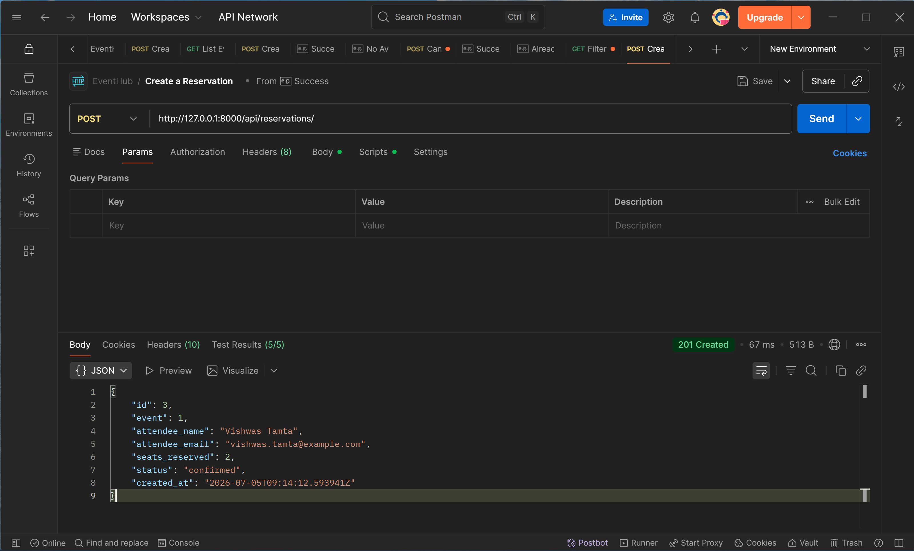
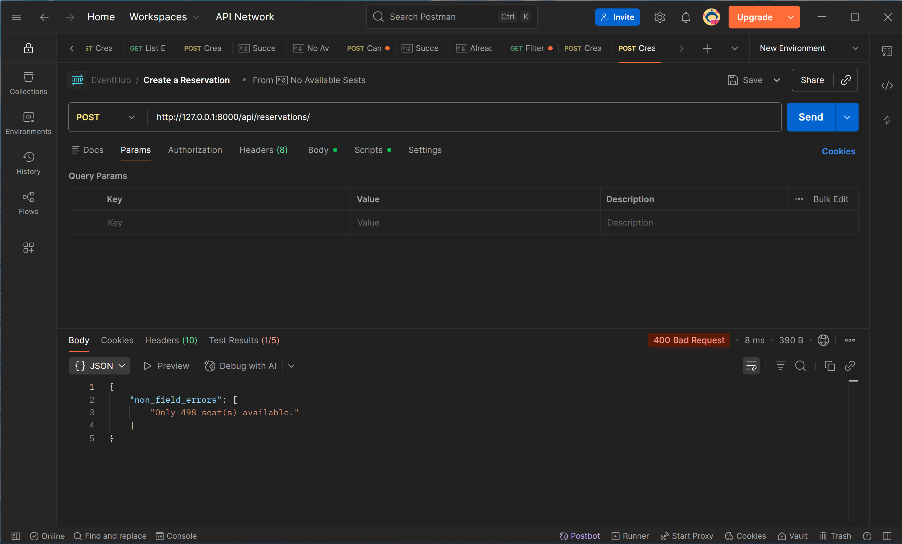
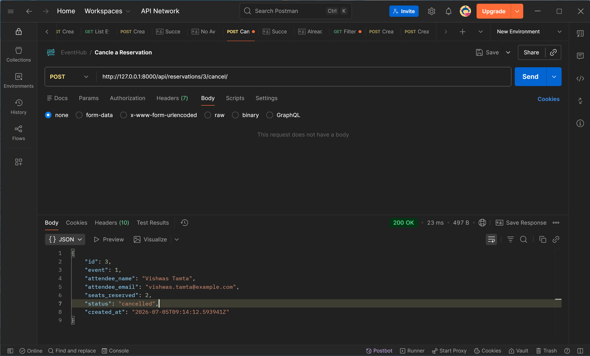

# EventHub API

## Overview

EventHub is a Django REST Framework backend API for a simplified event ticketing platform. It allows users to create and browse events, reserve seats, cancel reservations, and filter events and reservations.

## Tech Stack

* Python
* Django
* Django REST Framework
* SQLite

---

## Installation

### 1. Clone the repository

```bash
git clone <your-github-repository-url>
cd eventhub
```

### 2. Create and activate a virtual environment

Using **uv**:

```bash
uv venv
```

Activate the environment.

**Windows (PowerShell)**

```powershell
.venv\Scripts\Activate.ps1
```

**Windows (Command Prompt)**

```cmd
.venv\Scripts\activate
```

**macOS/Linux**

```bash
source .venv/bin/activate
```

### 3. Install dependencies

```bash
uv sync
```

Alternatively, if using `requirements.txt`:

```bash
pip install -r requirements.txt
```

### 4. Apply migrations

```bash
uv run python manage.py migrate
```

### 5. Run the development server

```bash
uv run python manage.py runserver
```

The API will be available at:

```
http://127.0.0.1:8000/api/
```

---

# API Endpoints

## Event Endpoints

### GET /api/events/

Returns all events.

Supports filtering:

* `?status=upcoming`
* `?venue=Bangalore`

---

### GET /api/events/{id}/

Returns a single event.

---

### POST /api/events/

Creates a new event.

---

### PUT/PATCH /api/events/{id}/

Updates an existing event.

---

### DELETE /api/events/{id}/

Deletes an event.

---

## Reservation Endpoints

### GET /api/reservations/

Returns all reservations.

Supports filtering:

* `?event_id=1`

---

### GET /api/reservations/{id}/

Returns a specific reservation.

---

### POST /api/reservations/

Creates a reservation and deducts the reserved seats from the associated event.

---

### POST /api/reservations/{id}/cancel/

Cancels a reservation, restores the reserved seats to the event, and updates the reservation status to `cancelled`.

---

### PUT/PATCH /api/reservations/{id}/

Updates a reservation.

---

### DELETE /api/reservations/{id}/

Deletes a reservation.

---

# Design Decision

The reservation creation logic is implemented inside the serializer's `create()` method, where the event's available seats are updated and the reservation is created together within a `transaction.atomic()` block. This ensures both operations are treated as a single database transaction—if either operation fails, all changes are rolled back. Keeping this logic in one place centralizes the reservation process, maintains data consistency, and prevents partial updates, such as seats being deducted without a corresponding reservation being created.

---

# Features

* Create, update, retrieve and delete events
* Create, update, retrieve and delete reservations
* Filter events by status and venue
* Filter reservations by event
* Prevent overbooking
* Prevent reservations for completed or cancelled events
* Restore seats when a reservation is cancelled
* Request logging middleware

# API Testing Screenshots

## 1. Successful Reservation (201 Created)

Demonstrates a successful reservation where seats are deducted from the event.



---

## 2. Overbooking Attempt (400 Bad Request)

Demonstrates validation that prevents reserving more seats than are available.



---

## 3. Successful Reservation Cancellation

Demonstrates cancelling a reservation, updating its status to `cancelled`, and restoring the reserved seats to the event.


